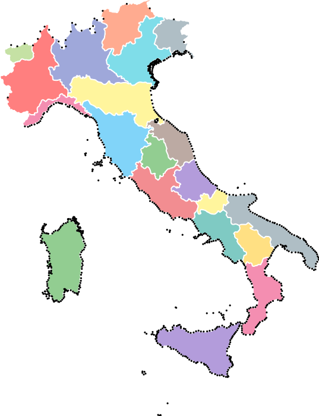
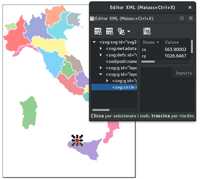

# svgkremer
A simple tool to get geo-awareness when working with svg. See this demo for an example of use.

## How it works
`svgkremer` takes a map in kmz format and gives back two things:
- a sketched svg of the map to help you put the graphics in place
- the formulas to translate longitude and latitude to the x and y in the aforementioned svg

## Example
1. Download the file [gadm36_ITA_0.kmz](https://biogeo.ucdavis.edu/data/gadm3.6/kmz/gadm36_ITA_0.kmz)
   representing the borders of Italy (you can find many other countries in the
   [GADM](https://gadm.org/download_country_v3.html) website).
2. Launch `svgkremer` providing the file and a width of 1000 and look at its output:
```
    $ svgkremer.py gadm36_ITA_0.kmz --width 1000 --out italy.svg
    f = lambda lat: 180/math.pi * math.log(math.tan(math.pi/4 + lat*(math.pi/180)/2))
    x = lng * 84.10559228343975 + -557.6939997674311
    y = f(lat) * -84.10559228343976 + 4500.662508182054
```
3. Using a vector graphic software, open `italy.svg` and put your graphic in place according to the dots,
   which can be removed afterwards



   *Black circles put by `svgkremer`, coloured areas added*
   
4. Use the formulas you got as output to get the svg coordinates of Palermo (latitude: 38.1320500°,
   longitude: 13.3356100°):
```
$ python
>>> lat = 38.1320500; lng = 13.3356100
>>> import math
>>> f = lambda lat: 180/math.pi * math.log(math.tan(math.pi/4 + lat*(math.pi/180)/2))
>>> x = lng * 84.10559228343975 + -557.6939997674311
>>> y = f(lat) * -84.10559228343976 + 4500.662508182054
>>> x, y
(563.905377743531, 1026.6467831520163)
```
5. Draw a circle and set its `cx` and `cy` to those values:


